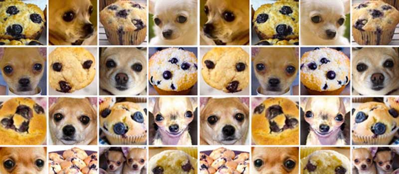

# Sagemaker CDK Demo

# Chihuahua or Muffin?

Create a Training Set using Sagemaker to determine if a picture is a Chihuahua or Muffin

---
## 💻 Services

- 🏔 [AWS CDK](https://aws.amazon.com/cdk/): AWS Infrastructure as Code (IaC) service
- 🏔 [AWS S3](https://aws.amazon.com/s3/): AWS Storage
- 🏔 [AWS Sagemaker](https://aws.amazon.com/sagemaker/): AWS Machine Learning (ML) Data Training, Modeling, and Deploymrnt

---
### 👩🏻‍🏫 Prerequisites

- [Create AWS Account & Configure AWS CLI](https://docs.aws.amazon.com/cli/latest/userguide/cli-chap-configure.html)
- [Download & Install CDK](https://docs.aws.amazon.com/cdk/latest/guide/getting_started.html)
- Clone resource

---
### 🏯 Infrastructure

- 3 Bucket with pictures (data set)
- SageMaker Team 
- SageMaker Labeling Job
- SageMaker Training Job

---
### 🏰 Project Infrastructure

The infrastructure for the project is as defined below.

├── README.md <---- This guide to the project.

├── cdk <---------- Contains CDK code for creating AWS Infrastructure

└──bin  <------------- CDK stack instantiation

└──imgs <------------- Image dataset 

└──lib <-------------- CDK stack definitions

└──test <------------- CDK stack tests

├── readme_imgs <-- Imgs for README.md

---
### 👩🏻‍💻 Running the Project

- Change directory into the cdk folder

`yarn install` installs all needed node_modules

- Deploy the stack by running the command

`yarn cdk deploy --all --profile <insert profile>` deploys the stack to your AWS account

---

### 👩🏻‍💻 Misc Notes

- 1.80.1 is currently the pinned version because of the following outstanding issue: https://github.com/aws/aws-cdk/issues/12291
- Using Built-In SageMaker Notebook: https://github.com/juliensimon/dlnotebooks/tree/master/sagemaker
